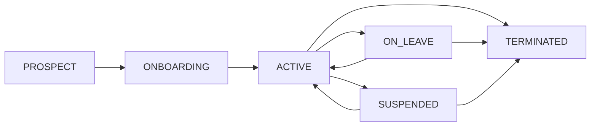

# Employee Management Business Logic

## 👥 Employee Lifecycle Management

### Onboarding Process

```php
class CreateEmployeeAction extends QueueableAction
{
    public function handle(array $data): Employee
    {
        // 1. Validate personal data
        $this->validatePersonalData($data);
        
        // 2. Generate unique employee code
        $employeeCode = $this->generateEmployeeCode();
        
        // 3. Create user account with temporary password
        $user = $this->createUserAccount($data, $employeeCode);
        
        // 4. Create employee profile
        $employee = $this->createEmployeeProfile($user, $data, $employeeCode);
        
        // 5. Assign default department and position
        $this->assignDefaultOrganization($employee);
        
        // 6. Generate welcome email and documentation
        $this->sendWelcomeNotifications($employee);
        
        return $employee;
    }
}
```

### Employee Status Transitions

```php
enum EmployeeStatusEnum: string
{
    case PROSPECT = 'prospect';        // Potential candidate
    case ONBOARDING = 'onboarding';    // In onboarding process
    case ACTIVE = 'active';            // Fully active employee
    case ON_LEAVE = 'on_leave';        // Temporary leave
    case SUSPENDED = 'suspended';      // Administrative suspension
    case TERMINATED = 'terminated';    // Employment ended
}
```

### Valid Status Transitions



## 🏢 Organizational Structure Management

### Department Hierarchy Rules

```php
class Department extends BaseModel
{
    // Maximum hierarchy depth: 7 levels
    const MAX_DEPTH = 7;
    
    // Department types with specific business rules
    const TYPE_CORPORATE = 'corporate';
    const TYPE_OPERATIONAL = 'operational';
    const TYPE_SUPPORT = 'support';
    const TYPE_PROJECT = 'project';
    
    public function canHaveSubdepartments(): bool
    {
        // Project departments cannot have subdepartments
        return $this->type !== self::TYPE_PROJECT;
    }
    
    public function getMaxEmployees(): ?int
    {
        // Operational departments have employee limits
        return match($this->type) {
            self::TYPE_OPERATIONAL => 50,
            self::TYPE_SUPPORT => 25,
            default => null // No limit for corporate/project
        };
    }
}
```

### Position Management

```php
class Position extends BaseModel
{
    // Position levels with salary bands
    const LEVEL_INTERN = 1;
    const LEVEL_JUNIOR = 2;
    const LEVEL_MID = 3;
    const LEVEL_SENIOR = 4;
    const LEVEL_LEAD = 5;
    const LEVEL_MANAGER = 6;
    const LEVEL_DIRECTOR = 7;
    const LEVEL_EXECUTIVE = 8;
    
    public function getSalaryRange(): array
    {
        return match($this->level) {
            self::LEVEL_INTERN => [20000, 25000],
            self::LEVEL_JUNIOR => [25000, 35000],
            self::LEVEL_MID => [35000, 50000],
            self::LEVEL_SENIOR => [50000, 70000],
            self::LEVEL_LEAD => [70000, 90000],
            self::LEVEL_MANAGER => [90000, 120000],
            self::LEVEL_DIRECTOR => [120000, 180000],
            self::LEVEL_EXECUTIVE => [180000, 300000],
        };
    }
}
```

## 📋 Leave Management Logic

### Leave Types and Accrual Rules

```php
enum LeaveTypeEnum: string
{
    case VACATION = 'vacation';
    case SICK = 'sick';
    case PERSONAL = 'personal';
    case MATERNITY = 'maternity';
    case PATERNITY = 'paternity';
    case BEREAVEMENT = 'bereavement';
    case UNPAID = 'unpaid';
}

class LeaveAccrualAction extends QueueableAction
{
    public function handle(Employee $employee): void
    {
        // Monthly vacation accrual: 1.66 days per month (20 days/year)
        if ($employee->isActive()) {
            $accruedDays = 1.66;
            
            // Seniority bonus: +0.5 days per year after 5 years
            $seniorityYears = $employee->getSeniorityYears();
            if ($seniorityYears > 5) {
                $accruedDays += ($seniorityYears - 5) * 0.5;
            }
            
            // Cap at 30 days maximum accrual
            $newBalance = min(
                $employee->leave_balance + $accruedDays,
                30.0
            );
            
            $employee->update(['leave_balance' => $newBalance]);
        }
    }
}
```

### Leave Request Validation

```php
class ValidateLeaveRequestAction extends QueueableAction
{
    public function handle(LeaveRequest $request): ValidationResult
    {
        $employee = $request->employee;
        
        // 1. Check available balance
        if ($request->days_requested > $employee->leave_balance) {
            return ValidationResult::invalid('Insufficient leave balance');
        }
        
        // 2. Check blackout periods (company holidays)
        if ($this->isBlackoutPeriod($request->start_date, $request->end_date)) {
            return ValidationResult::invalid('Request falls during blackout period');
        }
        
        // 3. Check minimum notice period (3 business days)
        if (!$this->meetsNoticePeriod($request->created_at)) {
            return ValidationResult::invalid('Insufficient notice period');
        }
        
        // 4. Check overlapping requests
        if ($this->hasOverlappingRequests($employee, $request)) {
            return ValidationResult::invalid('Overlapping leave request exists');
        }
        
        return ValidationResult::valid();
    }
}
```

## 📊 Performance Management

### Performance Rating System

```php
enum PerformanceRatingEnum: int
{
    case EXCEEDS_EXPECTATIONS = 5;
    case ABOVE_EXPECTATIONS = 4;
    case MEETS_EXPECTATIONS = 3;
    case BELOW_EXPECTATIONS = 2;
    case UNSATISFACTORY = 1;
}

class CalculatePerformanceBonusAction extends QueueableAction
{
    public function handle(Employee $employee, int $year): float
    {
        $rating = $employee->getPerformanceRating($year);
        $baseSalary = $employee->salary;
        
        return match($rating) {
            PerformanceRatingEnum::EXCEEDS_EXPECTATIONS => $baseSalary * 0.15,
            PerformanceRatingEnum::ABOVE_EXPECTATIONS => $baseSalary * 0.10,
            PerformanceRatingEnum::MEETS_EXPECTATIONS => $baseSalary * 0.05,
            PerformanceRatingEnum::BELOW_EXPECTATIONS => 0,
            PerformanceRatingEnum::UNSATISFACTORY => 0,
        };
    }
}
```

### Promotion Eligibility Rules

```php
class CheckPromotionEligibilityAction extends QueueableAction
{
    public function handle(Employee $employee, Position $targetPosition): EligibilityResult
    {
        $currentPosition = $employee->position;
        
        // 1. Check minimum time in current position (12 months)
        if ($employee->time_in_position < 12) {
            return EligibilityResult::ineligible('Minimum 12 months in current position required');
        }
        
        // 2. Check performance requirements (last 2 ratings >= MEETS_EXPECTATIONS)
        $recentRatings = $employee->getRecentPerformanceRatings(2);
        if (count(array_filter($recentRatings, fn($r) => $r->value >= 3)) < 2) {
            return EligibilityResult::ineligible('Performance requirements not met');
        }
        
        // 3. Check position hierarchy (max 2 level jumps)
        $levelDifference = $targetPosition->level - $currentPosition->level;
        if ($levelDifference > 2) {
            return EligibilityResult::ineligible('Maximum 2 level promotion allowed');
        }
        
        // 4. Check training requirements
        if (!$this->meetsTrainingRequirements($employee, $targetPosition)) {
            return EligibilityResult::ineligible('Training requirements not completed');
        }
        
        return EligibilityResult::eligible();
    }
}
```

## 🔐 Security & Authorization Rules

### Role-Based Access Control

```php
enum EmployeeRoleEnum: string
{
    case EMPLOYEE = 'employee';
    case TEAM_LEAD = 'team_lead';
    case DEPARTMENT_MANAGER = 'department_manager';
    case HR_MANAGER = 'hr_manager';
    case EXECUTIVE = 'executive';
}

class CheckEmployeeAccessAction extends QueueableAction
{
    public function handle(User $user, Employee $targetEmployee): bool
    {
        // Employees can only view their own data
        if ($user->hasRole(EmployeeRoleEnum::EMPLOYEE)) {
            return $user->id === $targetEmployee->user_id;
        }
        
        // Team leads can view their team members
        if ($user->hasRole(EmployeeRoleEnum::TEAM_LEAD)) {
            return $this->isTeamMember($user, $targetEmployee);
        }
        
        // Department managers can view department employees
        if ($user->hasRole(EmployeeRoleEnum::DEPARTMENT_MANAGER)) {
            return $user->department_id === $targetEmployee->department_id;
        }
        
        // HR and executives have full access
        return $user->hasAnyRole([
            EmployeeRoleEnum::HR_MANAGER,
            EmployeeRoleEnum::EXECUTIVE
        ]);
    }
}
```

### Data Privacy Rules

```php
class ApplyPrivacyRulesAction extends QueueableAction
{
    public function handle(Employee $employee, User $requestor): array
    {
        $data = $employee->toArray();
        
        // Hide sensitive data based on requester role
        if (!$requestor->hasRole(EmployeeRoleEnum::HR_MANAGER)) {
            unset($data['salary_data']);
            unset($data['personal_identification']);
            unset($data['bank_account']);
        }
        
        // Team leads see limited salary info
        if ($requestor->hasRole(EmployeeRoleEnum::TEAM_LEAD)) {
            $data['salary_band'] = $employee->position->getSalaryBand();
            unset($data['salary_data']);
        }
        
        return $data;
    }
}
```

## 📈 Reporting & Analytics Logic

### Headcount Reporting

```php
class GenerateHeadcountReportAction extends QueueableAction
{
    public function handle(Department $department, Carbon $date): array
    {
        return [
            'total_employees' => $this->countActiveEmployees($department, $date),
            'by_department' => $this->breakdownBySubdepartments($department, $date),
            'by_position' => $this->breakdownByPositionLevel($department, $date),
            'turnover_rate' => $this->calculateTurnoverRate($department, $date),
            'attrition_analysis' => $this->analyzeAttrition($department, $date),
        ];
    }
}
```

### Workforce Planning

```php
class ForecastWorkforceNeedsAction extends QueueableAction
{
    public function handle(Department $department, int $months = 12): WorkforceForecast
    {
        $currentHeadcount = $department->active_employees_count;
        $attritionRate = $this->calculateHistoricalAttritionRate($department);
        $growthProjection = $this->getGrowthProjection($department);
        
        $projectedHeadcount = $currentHeadcount;
        $hiringNeeds = [];
        
        for ($month = 1; $month <= $months; $month++) {
            // Apply attrition (monthly)
            $attritionLoss = round($projectedHeadcount * ($attritionRate / 12));
            $projectedHeadcount -= $attritionLoss;
            
            // Apply growth projection
            $growthGain = round($currentHeadcount * ($growthProjection / 12));
            $projectedHeadcount += $growthGain;
            
            // Calculate hiring need to maintain target
            $hiringNeeds[$month] = max(0, $growthGain + $attritionLoss);
        }
        
        return new WorkforceForecast($hiringNeeds, $projectedHeadcount);
    }
}
```

## 🔄 Integration Rules

### External System Synchronization

```php
class SyncWithExternalHRAction extends QueueableAction
{
    public function handle(Employee $employee): void
    {
        // 1. Validate data consistency
        if (!$this->validateDataConsistency($employee)) {
            throw new SyncException('Data consistency validation failed');
        }
        
        // 2. Prepare payload according to external system format
        $payload = $this->prepareSyncPayload($employee);
        
        // 3. Execute synchronization (with retry logic)
        $this->executeSyncWithRetry($payload);
        
        // 4. Update sync status and timestamp
        $employee->update(['last_sync_at' => now()]);
    }
}
```

### Data Export Rules

```php
class ExportEmployeeDataAction extends QueueableAction
{
    public function handle(Collection $employees, string $format): ExportResult
    {
        $data = [];
        
        foreach ($employees as $employee) {
            $row = [
                'employee_code' => $employee->employee_code,
                'full_name' => $employee->full_name,
                'department' => $employee->department->name,
                'position' => $employee->position->title,
                'status' => $employee->status->value,
                'hire_date' => $employee->hire_date->format('Y-m-d'),
            ];
            
            // Add sensitive data only for authorized exports
            if ($this->isAuthorizedExport()) {
                $row['email'] = $employee->email;
                $row['phone'] = $employee->phone;
            }
            
            $data[] = $row;
        }
        
        return $this->formatExport($data, $format);
    }
}
```

---

*This documentation represents the complete business logic for employee management. All implementations must follow these rules using Queueable Actions instead of Services, maintaining consistency with Laraxot architecture and English naming conventions.*