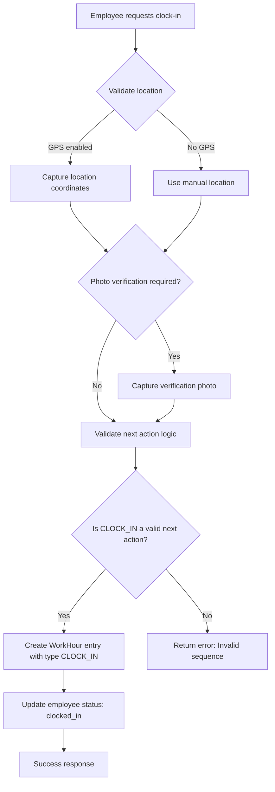
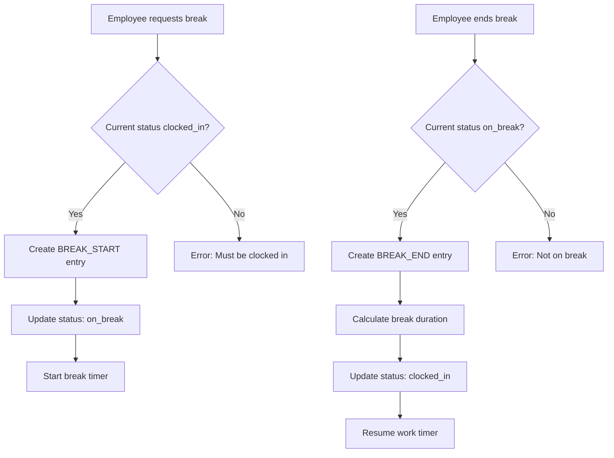
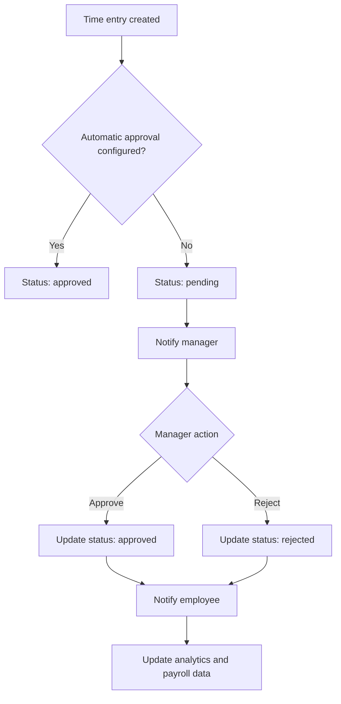
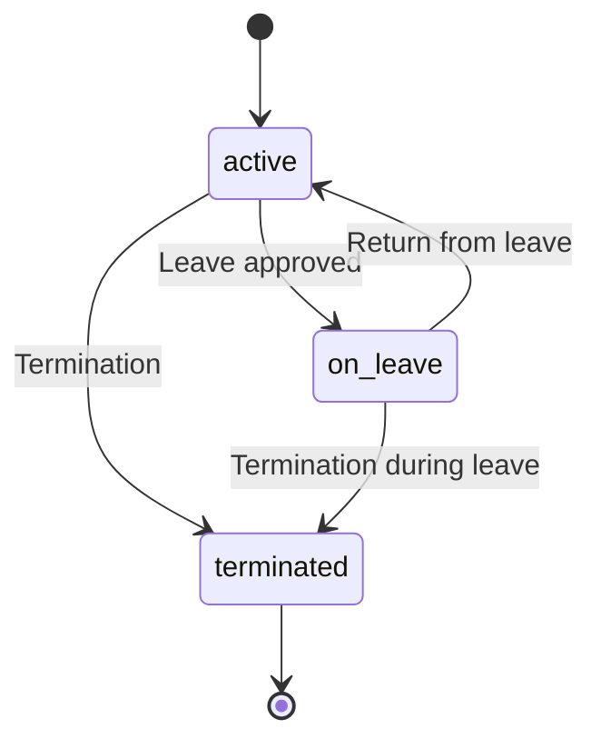
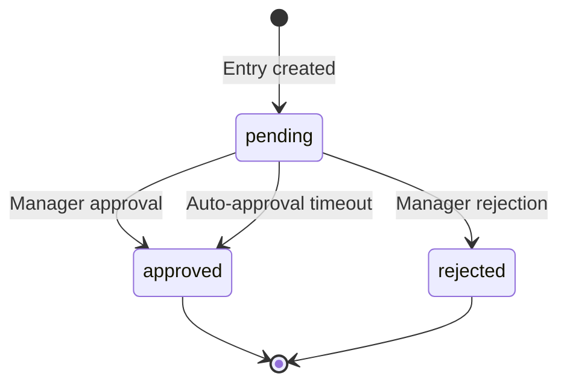

# Employee Module - Business Logic Overview

## 📋 Executive Summary

The Employee module implements a comprehensive HR management system with advanced time tracking capabilities, designed to replicate and enhance dipendentincloud.it functionality. This document outlines the core business logic, workflows, and decision-making processes that govern the module's behavior, ensuring consistency, compliance, and robustness.

## 🎯 Core Business Objectives

### 1. Employee Lifecycle Management
-   **Onboarding to Offboarding**: Manage the complete employee lifecycle, from initial hiring and contract management to termination and data archiving.
-   **Hierarchy and Structure**: Define and manage departments, job positions, and reporting lines to build a clear organizational chart.
-   **Career Progression**: Track promotions, position changes, and salary adjustments over time.
-   **Document Management**: Securely store and manage employee-related documents, such as contracts, certifications, and performance reviews.

### 2. Time & Attendance Tracking
-   **Real-time Clocking**: Provide a seamless and validated clock-in/out experience for employees.
-   **Break Management**: Accurately track break times and automatically calculate net work hours.
-   **Advanced Verification**: Enhance security and accuracy with optional GPS location and photo verification.
-   **Approval Workflows**: Implement multi-level approval workflows for time entries, overtime, and leave requests.

### 3. Compliance & Reporting
-   **Labor Law Adherence**: Ensure compliance with Italian labor laws, including regulations on working hours and breaks.
-   **GDPR Compliance**: Handle all personal data in a GDPR-compliant manner, with clear data retention policies and access controls.
-   **Audit Trail**: Maintain a complete and immutable audit trail for all significant actions and data changes.
-   **Analytics and Insights**: Provide real-time dashboards and reports for HR managers and executives.

## 🏗️ Core Business Entities

### Employee Model
The `Employee` model represents the central entity in the module, extending the base `User` model to include all HR-specific data.

```php
class Employee extends User
{
    // Core employee attributes
    protected $fillable = [
        'employee_code',        // Unique, non-sequential identifier for the employee.
        'personal_data',        // JSON blob for personal details (name, surname, date of birth, gender, tax code).
        'contact_data',         // JSON blob for contact information (residential address, phone number, personal email).
        'work_data',            // JSON blob for work-related details (department, job title, type of contract, start/end date).
        'documents',            // JSON array storing references to uploaded documents (ID card, resume, certifications).
        'photo_url',            // URL to the employee's profile picture.
        'status',               // Enum: active, on_leave, suspended, terminated.
        'department_id',        // Foreign key to the departments table.
        'manager_id',           // Foreign key to another employee (self-referencing) for the direct manager.
        'position_id',          // Foreign key to the job_positions table.
        'salary_data',          // JSON blob for salary and benefits information (gross annual salary, bonuses, benefits package).
    ];
}
```

### WorkHour Model (Time Tracking)
The `WorkHour` model is the cornerstone of the time and attendance tracking system, recording every single time-related event.

```php
class WorkHour extends BaseModel
{
    protected $fillable = [
        'employee_id',          // Foreign key to the employees table.
        'type',                 // Enum (WorkHourTypeEnum): clock_in, clock_out, break_start, break_end.
        'timestamp',            // Precise timestamp of the event.
        'location_lat',         // GPS latitude, captured at the time of the event.
        'location_lng',         // GPS longitude, captured at the time of the event.
        'location_name',        // Human-readable location name (e.g., "Main Office").
        'device_info',          // JSON blob with device fingerprint (IP address, user agent, device ID).
        'photo_path',           // Path to the verification photo, if required.
        'notes',                // Optional notes from the employee or manager.
        'status',               // Enum (WorkHourStatusEnum): pending, approved, rejected.
        'approved_by',          // User ID of the manager who approved/rejected the entry.
        'approved_at',          // Timestamp of the approval/rejection.
    ];
}
```

## 🔄 Core Business Workflows

### 1. Time Tracking Workflow
This workflow governs the entire process of an employee recording their work hours.

#### Clock In Process
The process is designed to be simple for the employee but robust in its validation.


#### Break Management
Break management follows a strict start/end sequence to ensure accurate calculation of work hours.


### 2. Approval Workflow
Time entries can be configured for automatic or manual approval.



## 🧠 Business Rules & Validation

### Time Entry Validation Rules
1.  **Sequence Validation**: Entries must strictly follow the logical sequence: `CLOCK_IN` → `BREAK_START` → `BREAK_END` → `CLOCK_OUT`. The system validates this using the `getNextAction` logic.
2.  **Time Validation**: Clock-in/out actions can be restricted to specific time windows or geofenced locations, as defined in company policy.
3.  **Location Validation**: If GPS is required, the employee's coordinates must be within a configurable radius of the designated workplace.
4.  **Duplicate Prevention**: The system prevents the creation of duplicate entries (e.g., two `CLOCK_IN` events in a row) within a configurable time window (e.g., 60 seconds).
5.  **Cross-day Validation**: The system correctly handles work shifts that span across midnight, attributing hours to the correct work day.

### Employee Status Rules
1.  **Active Employees**: Can perform all standard time tracking actions and access their self-service portal.
2.  **On Leave**: Time tracking is disabled. Leave requests follow a separate approval workflow.
3.  **Terminated**: All system access is revoked, but their historical data is preserved for compliance and reporting.
4.  **Probation**: May have different rules for leave accrual or access to certain benefits, as defined by HR policy.

### Department Hierarchy Rules
1.  **Manager Approval**: Managers can only view and approve time entries for employees within their direct or indirect reporting line.
2.  **Reporting Structure**: The organizational chart defined in the system dictates the approval chain. Changes in management automatically update the approval workflow.
3.  **Department Transfer**: When an employee moves to a new department, their historical data remains associated with their profile, and new entries are managed by the new department's hierarchy.

## 📊 Business Logic Implementation

### WorkHour Business Methods

#### Calculate Worked Hours
This method is the core of the payroll calculation logic.
```php
public static function calculateWorkedHours(int $employeeId, ?Carbon $date = null): float
{
    // Complex algorithm that accounts for:
    // - Multiple clock-in/out sessions within the same day.
    // - Subtraction of all break durations from the total worked time.
    // - Application of overtime rules based on company policy.
    // - Calculation of premiums for night shifts or work on holidays.
}
```

#### Next Action Prediction
This method provides the "smart" functionality for the time tracking UI.
```php
public static function getNextAction(int $employeeId, ?Carbon $date = null): WorkHourTypeEnum
{
    // Determines the next valid action based on the employee's last time entry.
    // This prevents logical errors, such as clocking out before clocking in.
}
```

### Employee Business Methods

#### Leave Balance Calculation
This method centralizes the logic for calculating leave balances.
```php
public function calculateLeaveBalance(string $leaveType): float
{
    // Calculates available leave days based on:
    // - The employee's start date and contract type.
    // - The company's leave accrual policy.
    // - All previously approved leave requests.
    // - Any carryover from the previous year, if applicable.
    // - Adjustments for probation periods or special conditions.
}
```

## ⚙️ Configuration & Policies

### Company Policy Configuration
All business rules are configurable to allow for flexibility across different companies.
```php
// config/employee.php
return [
    'working_hours' => [
        'standard_day' => 8,           // Standard working hours per day.
        'overtime_threshold' => 8,     // Hours after which overtime rates apply.
        'break_duration' => 60,        // Standard break duration in minutes.
        'max_break_duration' => 120,   // Maximum allowed break duration.
    ],
    
    'validation' => [
        'gps_required' => true,        // If true, GPS coordinates are mandatory for clock-in/out.
        'photo_verification' => true,  // If true, a photo is required for verification.
        'location_radius' => 100,      // Allowed radius in meters from the designated work location.
    ],
    
    'approval' => [
        'auto_approve' => false,       // If true, time entries are automatically approved.
        'approval_timeout' => 24,      // Hours after which a pending entry is auto-approved.
        'manager_hierarchy' => true,   // If true, approvals follow the organizational hierarchy.
    ],
];
```

### Compliance Settings
```php
'compliance' => [
    'italian_labor_law' => true,       // Enables rules specific to Italian labor law.
    'gdpr_compliance' => true,         // Enables GDPR-compliant data handling and masking.
    'audit_logging' => true,           // Enables a full audit trail for all actions.
    'data_retention' => [              // Defines data retention periods.
        'time_entries' => '5 years',
        'employee_data' => '10 years',
        'audit_logs' => '7 years',
    ],
],
```

## 🔍 Business Logic Examples

### Example 1: Time Entry Validation
```php
// Business rule: Cannot clock out without being clocked in.
if ($type === WorkHourTypeEnum::CLOCK_OUT) {
    $lastEntry = WorkHour::getLastEntryForEmployee($employeeId);
    
    if (!$lastEntry || !$lastEntry->type->isClockedIn()) {
        throw new BusinessRuleException('Cannot clock out without being clocked in.');
    }
}
```

### Example 2: Break Duration Validation
```php
// Business rule: Break cannot exceed the maximum configured duration.
$breakDuration = $this->calculateBreakDuration($employeeId);

if ($breakDuration > config('employee.working_hours.max_break_duration')) {
    throw new BusinessRuleException('Break duration exceeds the maximum allowed.');
}
```

### Example 3: Overtime Calculation
```php
// Business rule: Overtime is calculated for hours worked beyond the standard day.
$workedHours = WorkHour::calculateWorkedHours($employeeId, $date);
$standardHours = config('employee.working_hours.standard_day');

if ($workedHours > $standardHours) {
    $overtime = $workedHours - $standardHours;
    $overtimeRate = $this->calculateOvertimeRate($employee, $date);
    return $overtime * $overtimeRate;
}
```

## 🚦 Status Management

### Employee Status Transitions


### WorkHour Status Lifecycle


## 📈 Analytics & Reporting Business Logic

### Key Performance Indicators
1.  **Attendance Rate**: Percentage of scheduled work days that were actually worked.
2.  **Punctuality Score**: Average delay in clocking in compared to the official start time.
3.  **Overtime Analysis**: Breakdown of regular vs. emergency overtime hours, and costs.
4.  **Break Patterns**: Analysis of average break duration, frequency, and timing.
5.  **Productivity Metrics**: Correlation of work hours with project outputs or other performance metrics.

### Compliance Reporting
1.  **Italian DURC**: Generation of the Digital Unified Single Certification for social security contributions.
2.  **INPS Contributions**: Reports for social security contributions.
3.  **INAIL Reports**: Data for workplace injury insurance reporting.
4.  **GDPR Audits**: Logs of all access and processing of personal data.

## 🔐 Security & Access Business Rules

### Role-Based Access Control
1.  **Employees**: Can only view and manage their own time entries and personal data.
2.  **Managers**: Can view team data, approve subordinate entries, and access team-level reports.
3.  **HR Admins**: Have full access to all employee data, reports, and system configurations.
4.  **System Admins**: Manage system settings, integrations, and user access at the highest level.

### Data Visibility Rules
-   Employees cannot view the salary or personal contact information of their colleagues.
-   Managers can only see data for their direct and indirect reports, not for other departments.
-   HR admins have read/write access to most data, but all actions are logged in the audit trail.
-   Sensitive personal data is masked or redacted based on GDPR requirements and user roles.

## 🔄 Integration Business Logic

### External System Integration
1.  **Payroll Systems**: Automatic export of approved work hours and overtime for payroll processing.
2.  **Accounting Software**: Allocation of labor costs to different cost centers or projects.
3.  **Calendar Systems**: Synchronization of leave requests and work schedules with Google Calendar or Outlook.
4.  **Mobile Apps**: Real-time push notifications for approvals, rejections, and reminders.

### API Business Rules
-   **Rate Limiting**: API endpoints are rate-limited to prevent abuse and ensure system stability.
-   **Webhook Verification**: Incoming webhooks from external systems are verified using signatures to ensure authenticity.
-   **Data Validation**: All incoming data from APIs is rigorously validated against the defined schemas.
-   **Audit Logging**: All API-based actions are logged in the audit trail.

---

*This document represents the comprehensive business logic governing the Employee module. All implementations must adhere to these rules and workflows to ensure consistency, compliance, and proper functionality.*