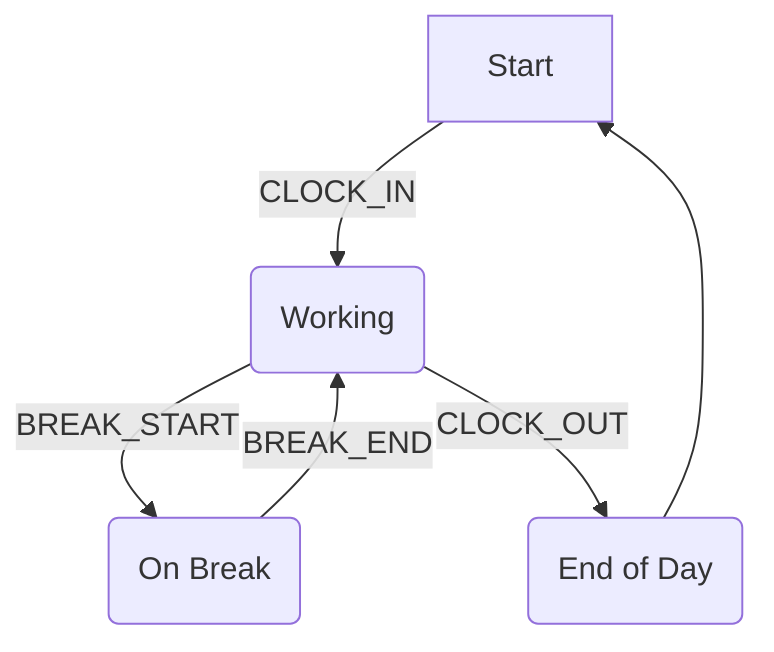

# Time Tracking Workflow & Business Logic

This document provides a detailed breakdown of the business logic, rules, and workflows that govern the time tracking functionality within the Employee module. It serves as a technical reference for implementation, ensuring consistency and compliance.

## 1. Core Concepts

### 1.1. Time Entry Types (`WorkHourTypeEnum`)

All time tracking events are categorized using an enum to ensure state integrity. Each entry represents a specific, non-overlapping action.

```php
// Located in: Modules/Employee/Enums/WorkHourTypeEnum.php
enum WorkHourTypeEnum: string
{
    case CLOCK_IN = 'clock_in';       // Marks the beginning of a work session.
    case CLOCK_OUT = 'clock_out';     // Marks the end of a work session.
    case BREAK_START = 'break_start'; // Marks the beginning of a break period.
    case BREAK_END = 'break_end';     // Marks the end of a break period.
}
```

### 1.2. Time Entry Status (`WorkHourStatusEnum`)

Each `WorkHour` entry has a status that determines its state in the approval workflow. All entries begin as `PENDING`.

```php
// Located in: Modules/Employee/Enums/WorkHourStatusEnum.php
enum WorkHourStatusEnum: string
{
    case PENDING = 'pending';    // Entry is awaiting manager review.
    case APPROVED = 'approved';  // Entry has been approved by a manager.
    case REJECTED = 'rejected';  // Entry has been rejected.
}
```

## 2. State Machine & Workflow

The time tracking system operates as a state machine, where each action transitions the employee's status to a new state. The `WorkHour` model and associated services enforce these transitions to prevent invalid or illogical time entries.

### 2.1. Valid State Transitions

The sequence of actions must follow a logical flow. The system validates the next action based on the employee's most recent time entry.



- **From `(none)` or `CLOCK_OUT`**: The only valid next action is `CLOCK_IN`.
- **From `CLOCK_IN` or `BREAK_END`**: The valid next actions are `BREAK_START` or `CLOCK_OUT`.
- **From `BREAK_START`**: The only valid next action is `BREAK_END`.

### 2.2. Business Rule: Next Action Prediction

The system provides a `getNextActions()` method on the `Employee` model, which returns a list of valid `WorkHourTypeEnum` values based on their last recorded action.

```php
// Located in: Modules/Employee/Models/Employee.php
public function getNextActions(): array
{
    $lastEntry = $this->workHours()->latest()->first();

    if (!$lastEntry) {
        return [WorkHourTypeEnum::CLOCK_IN];
    }

    return match ($lastEntry->type) {
        WorkHourTypeEnum::CLOCK_IN, WorkHourTypeEnum::BREAK_END => [
            WorkHourTypeEnum::BREAK_START,
            WorkHourTypeEnum::CLOCK_OUT,
        ],
        WorkHourTypeEnum::BREAK_START => [WorkHourTypeEnum::BREAK_END],
        WorkHourTypeEnum::CLOCK_OUT => [WorkHourTypeEnum::CLOCK_IN],
        default => [],
    };
}
```

### 2.3. Business Rule: Entry Validation

Before creating a new `WorkHour` entry, the `CreateWorkHourAction` validates the requested action against the employee's current state.

- **Rule**: The proposed action must be in the array returned by `employee->getNextActions()`.
- **Error Handling**: If the validation fails, a `ValidationException` is thrown with a user-friendly error message (e.g., "You cannot start a break before clocking in.").

## 3. Calculations

### 3.1. Business Rule: Worked Hours Calculation

Worked hours are calculated based on pairs of `CLOCK_IN`/`CLOCK_OUT` and `BREAK_START`/`BREAK_END` entries.

- **Algorithm**: The `TimeCalculationService` iterates through an employee's `WorkHour` entries for a given day.
- **Total Work Time**: `(CLOCK_OUT.timestamp - CLOCK_IN.timestamp) - SUM(BREAK_END.timestamp - BREAK_START.timestamp)`
- **Data Integrity**: The service flags days with incomplete pairs (e.g., a `CLOCK_IN` without a `CLOCK_OUT`) for administrative review.

## 4. Verification & Compliance

To ensure data accuracy and prevent fraud, the system includes optional verification mechanisms.

### 4.1. Business Rule: Location Verification (GPS)

- **Configuration**: Enabled via `config('employee.location_verification.enabled')`.
- **Logic**: When an employee clocks in or out, their device's GPS coordinates are captured.
- **Validation**: The system compares these coordinates against a list of approved work locations (e.g., office, client site) stored in the `locations` table.
- **Tolerance**: A configurable radius (`config('employee.location_verification.radius_meters')`) allows for minor GPS inaccuracies.
- **Flagging**: Entries made outside the allowed radius are flagged for manager review and require a justification note.

### 4.2. Business Rule: Photo Verification

- **Configuration**: Enabled via `config('employee.photo_verification.enabled')`.
- **Trigger**: Can be required for all entries, or only for those outside of standard working hours or approved locations.
- **Logic**: The system prompts the employee to take a selfie at the time of clocking in/out. The photo is stored securely and associated with the `WorkHour` entry.
- **Purpose**: Provides visual confirmation of the employee's presence, particularly for remote or off-site work.

## 5. Policies & Configuration

Business logic is driven by configurable policies to accommodate different company and regional requirements.

### 5.1. Business Rule: Department-Specific Working Hours

- **Logic**: Standard working hours, break policies, and overtime rules can be defined per department.
- **Implementation**: The `departments` table includes fields for `standard_work_hours_per_day`, `minimum_break_duration_minutes`, and `overtime_policy_id`.
- **Fallback**: If a department does not have a specific policy, the system-wide default from `config('employee.defaults.*')` is used.

### 5.2. Business Rule: Overtime & Premium Calculation

- **Logic**: The `PayrollService` calculates overtime and other premiums (e.g., night shifts, holiday work) based on approved `WorkHour` entries.
- **Rules Engine**: A flexible rules engine processes entries against company policies.
- **Example**: If `worked_hours > standard_work_hours`, the excess is logged as overtime with a multiplier (e.g., 1.5x) defined in the `overtime_policies` table.

## 6. Approval Workflow

### 6.1. Business Rule: Multi-Level & Fallback Approvers

- **Hierarchy**: The system supports a multi-level approval chain (e.g., Team Lead -> Department Manager).
- **Assignment**: Each employee is assigned a primary approver (`approver_id` on the `employees` table).
- **Fallback**: A fallback approver (`fallback_approver_id`) is designated to handle requests if the primary approver is unavailable (e.g., on leave).
- **Notifications**: Approvers are notified of pending requests via email and in-app notifications.

### 6.2. Business Rule: Auto-Approval

- **Configuration**: Enabled via `config('employee.auto_approval.enabled')`.
- **Conditions**: Entries can be automatically approved if they meet specific criteria:
  - The entry was made from a trusted GPS location.
  - The total worked hours for the day do not exceed the standard, and no overtime is recorded.
  - The employee has a high trust score or is part of a specific group (e.g., senior management).

## 7. Advanced Scenarios & Edge Cases

### 7.1. Business Rule: Duplicate Entry Prevention

- **Logic**: The system prevents the creation of a new `WorkHour` entry if an entry of the same type already exists for the employee within a configurable time window (e.g., 60 seconds).
- **Purpose**: Prevents accidental double-clicks from creating duplicate records.

### 7.2. Business Rule: Cross-Day Entry Handling

- **Scenario**: For shifts that span midnight (e.g., a night shift from 10 PM to 6 AM).
- **Logic**: The `TimeCalculationService` correctly associates the `CLOCK_OUT` event with the previous day's `CLOCK_IN` event, ensuring hours are allocated to the correct work date.

## 8. Analytics & Reporting

### 8.1. Business Rule: Compliance Reporting

- **Logic**: The system generates reports to monitor compliance with labor laws, such as maximum working hours per week and mandatory break periods.
- **Alerts**: Managers are alerted if an employee is approaching a compliance limit.

### 8.2. Business Rule: Payroll Integration

- **Logic**: Approved hours (standard, overtime, premiums) are aggregated and exported in a format compatible with the company's payroll system.
- **Service**: The `PayrollExportService` handles the data transformation and export process.