# Employee Module - Data Flows Documentation

> **Documento generato**: 2024-09-03  
> **Versione**: 1.0  
> **Compliance**: Laraxot Philosophy  

## Workflow Principale: Time Tracking

### 1. Flusso Timbratura Standard

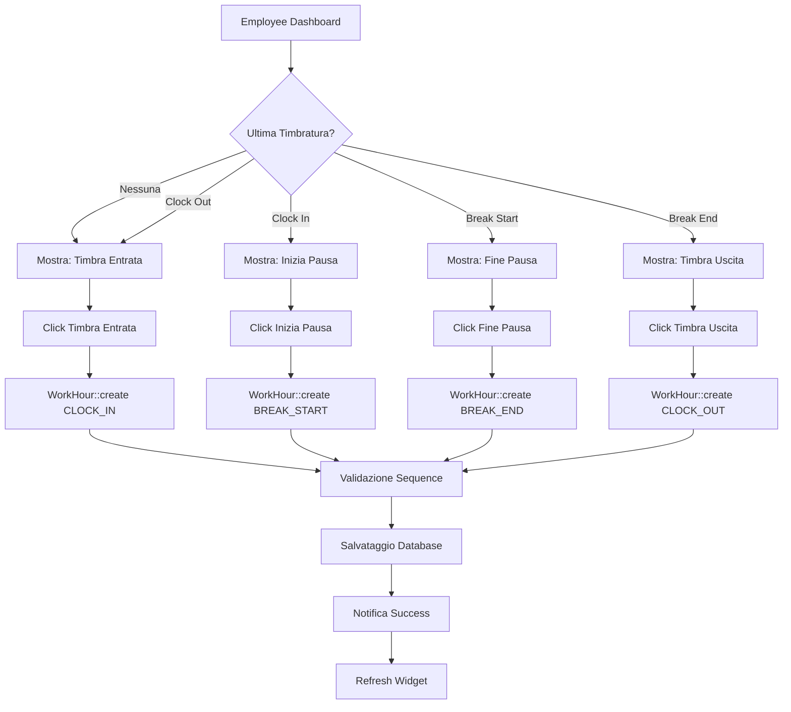

### 2. Flusso Validazione Business Logic

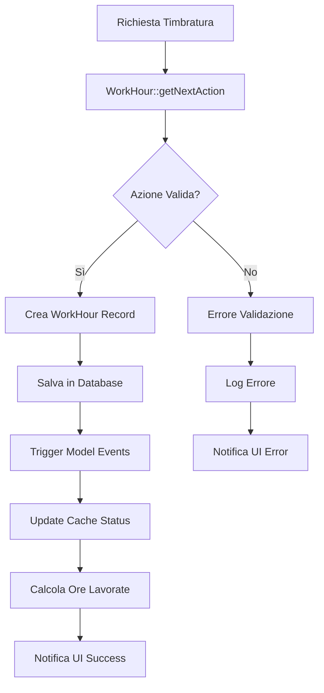

### 3. Flusso Calcolo Ore Lavorate

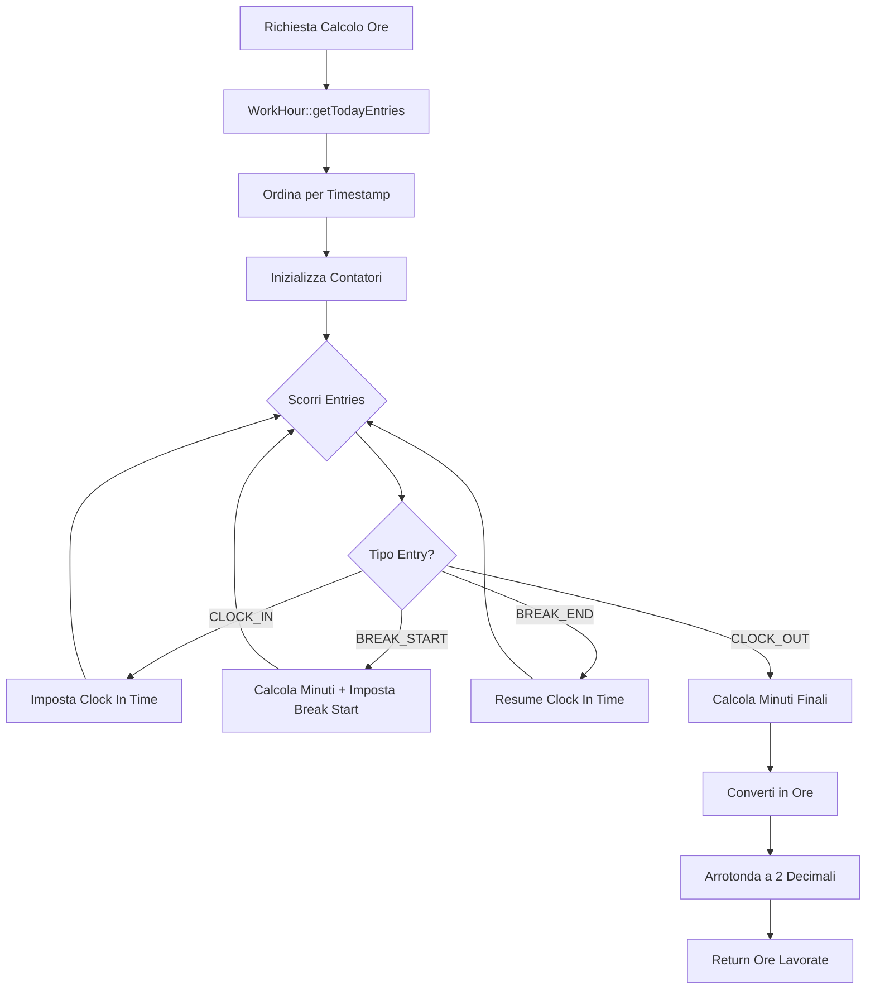

## Data Flow Patterns

### 1. Request-Response Pattern

```php
/**
 * Pattern standard per azioni timbratura
 */
[UI Widget] --> [Livewire Action] --> [Business Logic] --> [Database] --> [Cache Update] --> [UI Refresh]

// Esempio: Clock In Action
TimeClockWidget::clockIn() 
    -> WorkHour::create(['type' => CLOCK_IN]) 
    -> Database INSERT 
    -> Cache::forget('status_' . $employeeId)
    -> $this->refresh()
```

### 2. Event-Driven Pattern

```php
/**
 * Eventi automatici per audit trail
 */
WorkHour::created() --> [
    LogActivity::create(),
    NotifyManager::dispatch(),
    CacheInvalidation::handle(),
    StatisticsUpdate::queue()
]
```

### 3. State Synchronization Pattern

```php
/**
 * Sincronizzazione stato UI con database
 */
Database State <--> Cache Layer <--> Widget State <--> UI Display

// Polling automatico ogni 30 secondi
setInterval(() => {
    Livewire.emit('refresh-status');
}, 30000);
```

## Flussi di Integrazione

### 1. Employee Creation Flow

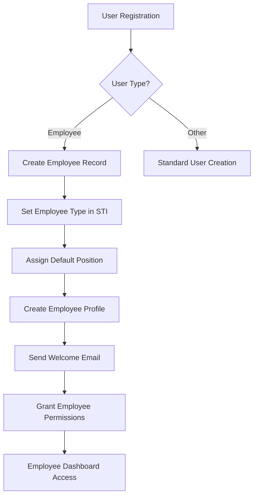

### 2. Approval Workflow

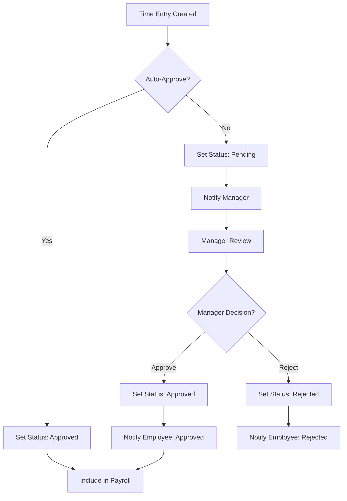

### 3. Reporting Data Flow

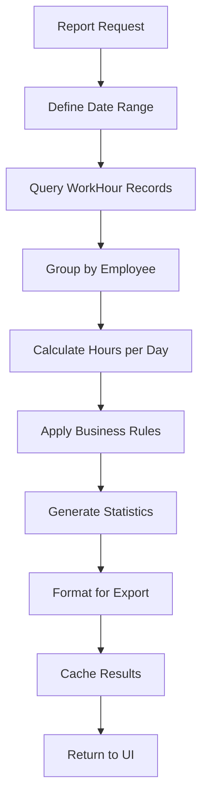

## Database Transaction Flows

### 1. Time Entry Transaction

```sql
BEGIN TRANSACTION;

-- 1. Validate previous entry
SELECT * FROM work_hours 
WHERE employee_id = ? 
ORDER BY timestamp DESC 
LIMIT 1;

-- 2. Insert new entry
INSERT INTO work_hours (
    employee_id, type, timestamp, 
    location_lat, location_lng, device_info
) VALUES (?, ?, ?, ?, ?, ?);

-- 3. Update cache table (if exists)
UPDATE employee_daily_stats 
SET last_action = ?, last_timestamp = ?
WHERE employee_id = ? AND date = ?;

COMMIT;
```

### 2. Daily Rollup Transaction

```sql
BEGIN TRANSACTION;

-- Aggregate daily hours
INSERT INTO daily_work_summaries (
    employee_id, work_date, 
    total_hours, total_breaks, 
    first_entry, last_entry
)
SELECT 
    employee_id,
    DATE(timestamp) as work_date,
    calculateWorkedHours(employee_id, DATE(timestamp)) as total_hours,
    COUNT(*) FILTER (WHERE type IN ('break_start', 'break_end')) / 2 as total_breaks,
    MIN(timestamp) as first_entry,
    MAX(timestamp) as last_entry
FROM work_hours
WHERE DATE(timestamp) = ?
GROUP BY employee_id, DATE(timestamp)
ON CONFLICT (employee_id, work_date) 
DO UPDATE SET 
    total_hours = EXCLUDED.total_hours,
    total_breaks = EXCLUDED.total_breaks,
    last_entry = EXCLUDED.last_entry;

COMMIT;
```

## Cache Data Flows

### 1. Multi-Level Caching Strategy

```php
/**
 * L1: Widget Cache (30 seconds)
 */
$widgetData = cache()->remember("widget_data_{$employeeId}", 30, function() {
    return [
        'currentStatus' => WorkHour::getCurrentStatus($employeeId),
        'todayHours' => WorkHour::getCachedWorkedHours($employeeId, today()),
        'todayEntries' => WorkHour::getTodayEntries($employeeId),
    ];
});

/**
 * L2: Daily Statistics Cache (5 minutes)
 */
$dailyStats = cache()->remember("daily_stats_{$employeeId}_{$date}", 300, function() {
    return WorkHour::calculateWorkedHours($employeeId, $date);
});

/**
 * L3: Monthly Reports Cache (1 hour)
 */
$monthlyReport = cache()->remember("monthly_report_{$employeeId}_{$month}", 3600, function() {
    return WorkHour::generateMonthlyReport($employeeId, $month);
});
```

### 2. Cache Invalidation Flow

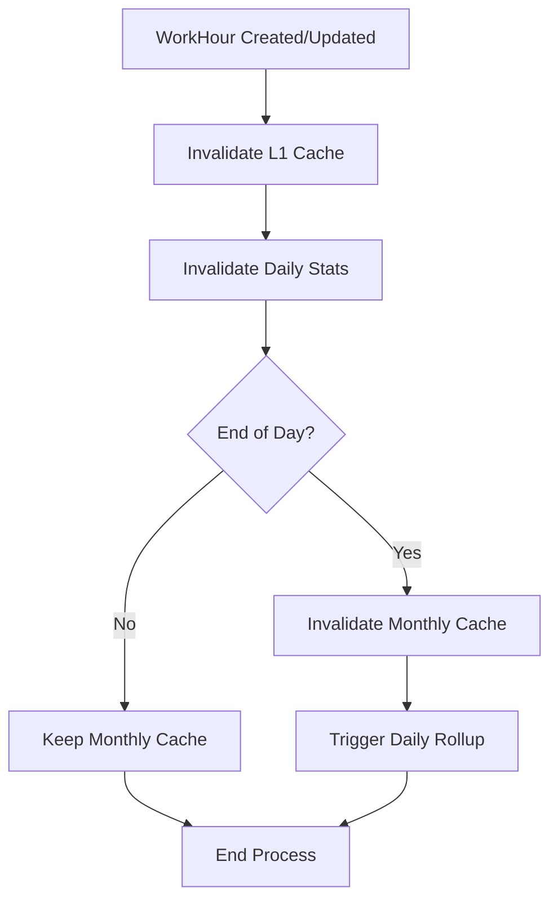

## Error Handling Flows

### 1. Validation Error Flow

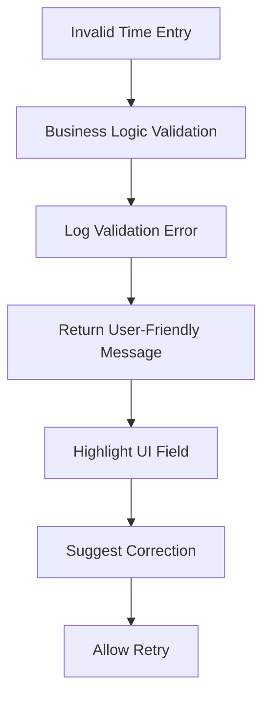

### 2. System Error Flow

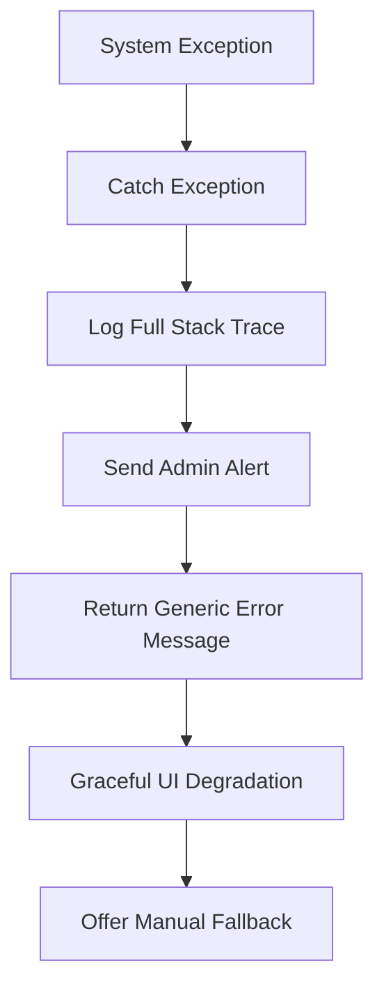

## Performance Optimization Flows

### 1. Query Optimization

```php
/**
 * Ottimizzazione query per dashboard
 */
// Before: N+1 Query Problem
foreach ($employees as $employee) {
    $employee->getTodayHours(); // Separate query each time
}

// After: Eager Loading + Bulk Calculation
$employees = Employee::with(['workHours' => function($query) {
    $query->whereDate('timestamp', today());
}])->get();

$employees->each(function($employee) {
    $employee->today_hours = $employee->workHours->calculateHours();
});
```

### 2. Background Job Flow

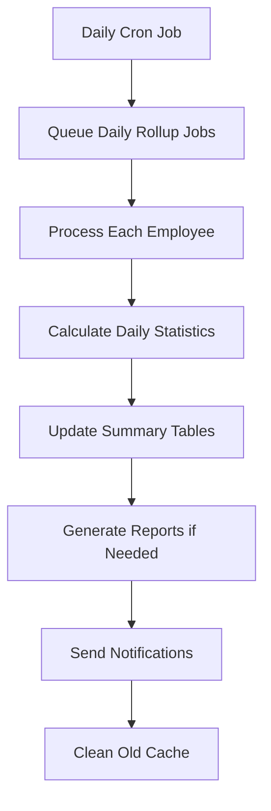

## API Data Flows (Future)

### 1. Mobile App Integration

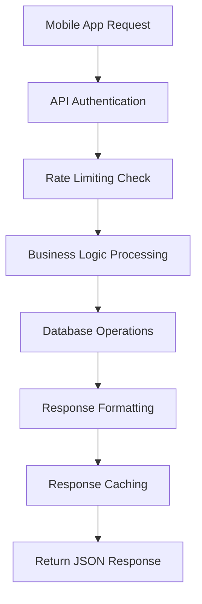

### 2. External System Integration

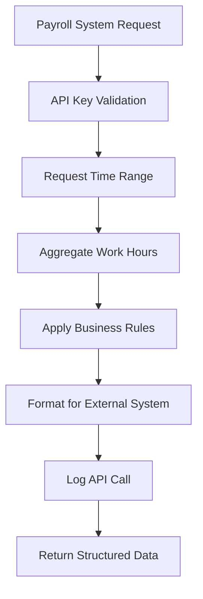

## Data Consistency Patterns

### 1. Eventually Consistent Cache

```php
/**
 * Pattern per eventual consistency
 */
// 1. Update database immediately
WorkHour::create($data);

// 2. Update cache asynchronously  
dispatch(new UpdateCacheJob($employeeId, $date));

// 3. UI shows stale data briefly, then refreshes
// Acceptable for non-critical display data
```

### 2. Strict Consistency for Business Logic

```php
/**
 * Pattern per strict consistency su validazioni
 */
DB::transaction(function() use ($employeeId, $type) {
    // 1. Lock per consistency
    $lastEntry = WorkHour::where('employee_id', $employeeId)
        ->lockForUpdate()
        ->latest('timestamp')
        ->first();
    
    // 2. Validate within transaction
    if (!WorkHour::isValidNextEntry($employeeId, $type, $lastEntry)) {
        throw new InvalidSequenceException();
    }
    
    // 3. Create entry atomically
    WorkHour::create([...]);
});
```

---

*Documento tecnico per sviluppatori - Allineato con Laraxot Architecture Patterns*
