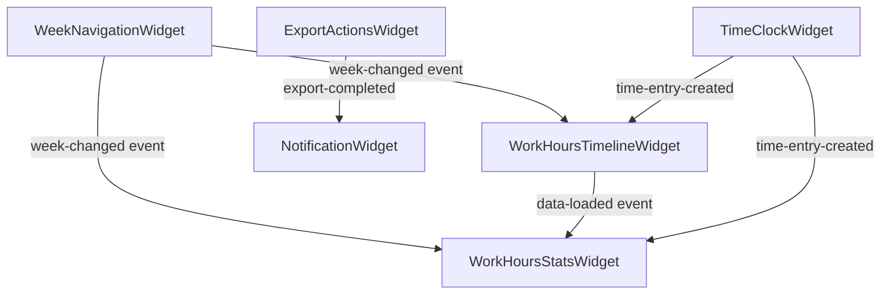

# Widget Gestione Orari Dipendenti - Filament

## 📋 Indice

1. [Panoramica](#panoramica)
2. [Architettura Widget-Driven](#architettura-widget-driven)
3. [Analisi WorkHoursPage vs Widget](#analisi-workhourspage-vs-widget)
4. [Widget Principali del Sistema](#widget-principali-del-sistema)
5. [Estrazione della Logica dai Pages](#estrazione-della-logica-dai-pages)
6. [Implementazione Widget-Centric](#implementazione-widget-centric)
7. [Dashboard Composition](#dashboard-composition)
8. [Performance e Caching](#performance-e-caching)
9. [Testing Strategy](#testing-strategy)
10. [Migration Guide](#migration-guide)

## 🎯 Panoramica

### Filosofia Widget-First

Il sistema di gestione orari dipendenti segue una **architettura widget-centric** dove:

- **Pages** sono contenitori minimali con poca o nessuna logica
- **Widgets** contengono tutta la business logic e interazioni
- **Actions** gestiscono le operazioni complesse
- **Components** forniscono UI riutilizzabile

### Modulo Employee: Stato Attuale

Dall'analisi del codice esistente nel modulo Employee:

#### Pages Esistenti con Troppa Logica
- `WorkHoursPage.php` - 130 righe con business logic inline
- Contiene logiche di navigazione settimana
- Gestisce export/import dati
- Calcola date range e formattazione
- **PROBLEMA**: Logica dispersa e non riutilizzabile

#### Widget Attuali ben Progettati
- `TimeClockWidget.php` - Widget completo per timbrature (280+ righe)
- `WorkHoursBoardWidget.php` - Timeline settimanale dedicata
- `AttendanceOverviewWidget.php` - Panoramica presenze
- **PUNTO DI FORZA**: Logica incapsulata e riutilizzabile

### Obiettivo della Ristrutturazione

1. **Semplificare WorkHoursPage** riducendola a ~30-40 righe
2. **Estrarre logica in widget specializzati** per riutilizzo
3. **Migliorare performance** con caching a livello widget
4. **Facilitare testing** con unit test sui singoli widget

## 🏗️ Architettura Widget-Driven

### Principi di Progettazione

#### 1. Separazione delle Responsabilità
```php
// ❌ PRIMA: WorkHoursPage con troppa logica
class WorkHoursPage extends XotBasePage
{
    public function getViewData(): array {        // 30+ righe di logica
        $payload = app(BuildWorkHoursForRangeAction::class)->execute(...);
        $weekData = app(BuildWeeklyTimeTableAction::class)->execute(...);
        return [/* 15+ array elements */];
    }

    public function previousWeek() { /* logica navigazione */ }
    public function nextWeek() { /* logica navigazione */ }
    public function updateDateRange() { /* logica date */ }
    public function exportData() { /* logica export */ }
}

// ✅ DOPO: Page minimalista + Widget specializzati
class WorkHoursPage extends XotBasePage
{
    protected static string $view = 'employee::filament.pages.work-hours';

    protected function getHeaderWidgets(): array {
        return [
            WeekNavigationWidget::class,
            WorkHoursTimelineWidget::class,
            WorkHoursStatsWidget::class,
        ];
    }
}
```

#### 2. Widget Specializzati per Funzionalità

**WeekNavigationWidget** - Gestione navigazione settimane
**WorkHoursTimelineWidget** - Visualizzazione timeline
**WorkHoursStatsWidget** - Statistiche e summary
**TimeClockWidget** - Timbrature real-time (già esistente)
**ExportActionsWidget** - Azioni import/export

## 📊 Analisi WorkHoursPage vs Widget

### Logiche da Estrarre dalla Page

#### 1. Navigazione Settimane (50+ righe di codice)
```php
// Da WorkHoursPage.php - LINEE 64-95
public function updateDateRange(string $start, string $end): void
public function previousWeek(): void
public function nextWeek(): void
public function currentWeek(): void

// ➜ SPOSTARE IN: WeekNavigationWidget
```

#### 2. Logica Export (15+ righe)
```php
// Da WorkHoursPage.php - LINEE 108-118
public function exportData(): void {
    app(ExportTimeDataAction::class)->onQueue('exports')->execute(...);
    $this->notify('Export avviato...');
}

// ➜ SPOSTARE IN: ExportActionsWidget
```

#### 3. Calcoli e Formattazione (10+ righe)
```php
// Da WorkHoursPage.php - LINEE 122-129
public function formatMinutesToHours(int $minutes): string {
    $hours = intdiv($minutes, 60);
    return sprintf('%d:%02d', $hours, $mins);
}

// ➜ SPOSTARE IN: WorkHoursStatsWidget o Helper Class
```

#### 4. Data Loading Complex (20+ righe)
```php
// Da WorkHoursPage.php - LINEE 36-59
protected function getViewData(): array {
    $payload = app(BuildWorkHoursForRangeAction::class)->execute(...);
    $weekData = app(BuildWeeklyTimeTableAction::class)->execute(...);
    return [/* 8+ elementi array */];
}

// ➜ DISTRIBUIRE TRA: Widget specializzati con caching dedicato
```

## 🧩 Widget Principali del Sistema

### 1. WeekNavigationWidget (NUOVO)

**Responsabilità:**
- Navigazione prev/next settimana
- Selezione date range personalizzato
- Calendario popup integrato
- Validazione limiti temporali

```php
namespace Modules\Employee\Filament\Widgets;

class WeekNavigationWidget extends XotBaseWidget
{
    public Carbon $startDate;
    public Carbon $endDate;

    public function mount(): void {
        $this->startDate = Carbon::now()->startOfWeek();
        $this->endDate = Carbon::now()->endOfWeek();
    }

    public function previousWeek(): void {
        $this->startDate = $this->startDate->subWeek();
        $this->endDate = $this->endDate->subWeek();
        $this->dispatch('week-changed', [
            'start' => $this->startDate->toDateString(),
            'end' => $this->endDate->toDateString()
        ]);
    }

    public function nextWeek(): void {
        $this->startDate = $this->startDate->addWeek();
        $this->endDate = $this->endDate->addWeek();
        $this->dispatch('week-changed', [
            'start' => $this->startDate->toDateString(),
            'end' => $this->endDate->toDateString()
        ]);
    }
}
```

### 2. WorkHoursTimelineWidget (UPGRADE ESISTENTE)

**Basato su:** `WorkHoursBoardWidget.php` esistente
**Miglioramenti:**
- Listener per eventi `week-changed`
- Caching dedicato per performance
- Ottimizzazioni query con scope

```php
class WorkHoursTimelineWidget extends XotBaseWidget
{
    protected $listeners = ['week-changed' => 'updateWeekRange'];

    #[Computed(cache: true, keep: false)]
    public function weekData(): array {
        return Cache::remember(
            "work-hours-timeline-{$this->startDate}-{$this->endDate}-" . Auth::id(),
            300, // 5 minuti cache
            fn() => app(BuildWorkHoursForRangeAction::class)->execute(
                Auth::id(), $this->startDate, $this->endDate
            )
        );
    }
}
```

### 3. WorkHoursStatsWidget (NUOVO)

**Responsabilità:**
- Calcoli ore lavorate/programmate
- Statistiche settimanali/mensili
- Alerting discrepanze orarie
- Formattazione display ore

```php
class WorkHoursStatsWidget extends XotBaseStatsOverviewWidget
{
    protected function getStats(): array {
        $data = $this->getCachedWeekData();

        return [
            Stat::make('Ore Lavorate', $this->formatHours($data['worked_minutes']))
                ->description('Questa settimana')
                ->descriptionIcon('heroicon-m-clock')
                ->color('success'),

            Stat::make('Ore Programmate', $this->formatHours($data['scheduled_minutes']))
                ->description('Target settimanale')
                ->descriptionIcon('heroicon-m-calendar')
                ->color('primary'),

            Stat::make('Differenza', $this->formatDifference($data['difference_minutes']))
                ->description($data['difference_minutes'] >= 0 ? 'Surplus' : 'Deficit')
                ->descriptionIcon('heroicon-m-chart-bar')
                ->color($data['difference_minutes'] >= 0 ? 'success' : 'danger'),
        ];
    }

    private function formatHours(int $minutes): string {
        $hours = intdiv($minutes, 60);
        $mins = $minutes % 60;
        return sprintf('%d:%02dh', $hours, $mins);
    }
}
```

### 4. ExportActionsWidget (NUOVO)

**Responsabilità:**
- Export dati in vari formati (XLSX, PDF, CSV)
- Import bulk timbrature
- Template management
- Job queue monitoring

```php
class ExportActionsWidget extends XotBaseWidget
{
    public function exportWeekData(string $format = 'xlsx'): void {
        $userId = Auth::id();

        app(ExportTimeDataAction::class)
            ->onQueue('exports')
            ->execute($userId, $this->startDate, $this->endDate, $format);

        Notification::make()
            ->title('Export Avviato')
            ->body("Riceverai una notifica quando il file $format sarà pronto")
            ->success()
            ->send();
    }

    public function importTemplate(): void {
        return response()->download(
            storage_path('app/templates/work-hours-template.xlsx')
        );
    }
}
```

## 🔧 Estrazione della Logica dai Pages

### Step-by-Step Migration Plan

#### Fase 1: Creazione Widget Base
1. Creare `WeekNavigationWidget` con logica navigazione
2. Estrarre `exportData()` in `ExportActionsWidget`
3. Spostare `formatMinutesToHours()` in `WorkHoursStatsWidget`

#### Fase 2: Event-Driven Communication
```php
// WeekNavigationWidget.php
public function weekChanged(): void {
    $this->dispatch('week-range-updated', [
        'start' => $this->startDate->toDateString(),
        'end' => $this->endDate->toDateString()
    ]);
}

// WorkHoursTimelineWidget.php
protected $listeners = [
    'week-range-updated' => 'updateWeekData'
];

public function updateWeekData($range): void {
    $this->startDate = Carbon::parse($range['start']);
    $this->endDate = Carbon::parse($range['end']);
    // Clear cache and reload
    $this->clearCache();
}
```

#### Fase 3: Page Refactoring
```php
// WorkHoursPage.php - VERSIONE FINALE (30 righe)
class WorkHoursPage extends XotBasePage
{
    protected static string $view = 'employee::filament.pages.work-hours';

    protected function getHeaderWidgets(): array {
        return [
            WeekNavigationWidget::class,
            ExportActionsWidget::class,
        ];
    }

    protected function getWidgets(): array {
        return [
            WorkHoursTimelineWidget::class,
            WorkHoursStatsWidget::class,
        ];
    }

    // Rimossi tutti i metodi di logica business!
}
```

## 📱 Dashboard Composition

### Layout Responsive Design

#### Desktop Layout (3 colonne)
```
┌─────────────────────────────────────────┐
│ WeekNavigationWidget | ExportActionsWgt │
├─────────────────────────────────────────┤
│           WorkHoursTimelineWidget       │
├─────────────────────────────────────────┤
│            WorkHoursStatsWidget         │
└─────────────────────────────────────────┘
```

#### Mobile Layout (Stack verticale)
```
┌─────────────────┐
│ WeekNavigation  │
├─────────────────┤
│ ExportActions   │
├─────────────────┤
│ Timeline        │
│ (compatto)      │
├─────────────────┤
│ Stats Summary   │
└─────────────────┘
```

### Widget Communication Flow



## ⚡ Performance e Caching

### Strategia Caching Multi-Layer

#### 1. Widget-Level Caching
```php
use Livewire\Attributes\Computed;

#[Computed(cache: true, keep: false)]
public function weeklyData(): array {
    return Cache::remember(
        "week-data-" . $this->weekKey() . "-" . Auth::id(),
        300, // 5 minuti
        fn() => $this->loadWeekData()
    );
}

private function weekKey(): string {
    return $this->startDate->format('Y-m-d') . '_' . $this->endDate->format('Y-m-d');
}
```

#### 2. Query Optimization
```php
// Prima: N+1 queries
$workHours = WorkHour::where('employee_id', $userId)
    ->whereDate('created_at', today())
    ->get()
    ->each(function($hour) {
        $hour->employee->name; // N+1!
    });

// Dopo: Single query with eager loading
$workHours = WorkHour::with(['employee:id,first_name,last_name'])
    ->where('employee_id', $userId)
    ->whereDate('created_at', today())
    ->get();
```

#### 3. Cache Invalidation Strategy
```php
// In TimeEntry model
protected static function booted(): void {
    static::saved(function (TimeEntry $entry) {
        // Invalida cache widget per l'utente specifico
        Cache::forget("week-data-*-{$entry->employee_id}");
        Cache::forget("work-hours-timeline-*-{$entry->employee_id}");
    });
}
```

## 🧪 Testing Strategy

### Unit Testing per Widget

#### WeekNavigationWidget Test
```php
use Pest\Laravel;
use Illuminate\Foundation\Testing\DatabaseTransactions;

describe('WeekNavigationWidget', function () {
    uses(DatabaseTransactions::class);

    beforeEach(function () {
        $this->user = User::factory()->create();
        $this->actingAs($this->user);
        $this->widget = Livewire::test(WeekNavigationWidget::class);
    });

    it('initializes with current week', function () {
        $this->widget
            ->assertSet('startDate', Carbon::now()->startOfWeek())
            ->assertSet('endDate', Carbon::now()->endOfWeek());
    });

    it('navigates to previous week correctly', function () {
        $this->widget->call('previousWeek');

        expect($this->widget->get('startDate'))
            ->toEqual(Carbon::now()->subWeek()->startOfWeek());
    });

    it('dispatches week-changed event', function () {
        $this->widget
            ->call('nextWeek')
            ->assertDispatched('week-changed');
    });
});
```

#### WorkHoursTimelineWidget Test
```php
describe('WorkHoursTimelineWidget', function () {
    uses(DatabaseTransactions::class);

    it('loads work hours for authenticated user', function () {
        $user = User::factory()->create();
        WorkHour::factory()->count(5)->create(['employee_id' => $user->id]);

        $this->actingAs($user);

        $widget = Livewire::test(WorkHoursTimelineWidget::class);

        expect($widget->get('weekData'))
            ->toHaveKey('summary')
            ->toHaveKey('byDate');
    });

    it('responds to week-changed events', function () {
        $widget = Livewire::test(WorkHoursTimelineWidget::class);

        $newStart = Carbon::now()->addWeek()->startOfWeek();
        $newEnd = Carbon::now()->addWeek()->endOfWeek();

        $widget->dispatch('week-changed', [
            'start' => $newStart->toDateString(),
            'end' => $newEnd->toDateString()
        ]);

        expect($widget->get('startDate'))->toEqual($newStart);
        expect($widget->get('endDate'))->toEqual($newEnd);
    });
});
```

### Integration Testing

#### Full Dashboard Flow Test
```php
it('completes full week navigation and export flow', function () {
    $user = User::factory()->create();
    WorkHour::factory()->count(10)->create(['employee_id' => $user->id]);

    $this->actingAs($user);

    // Test page loads with all widgets
    $this->get('/employee/work-hours')
        ->assertSeeLivewire(WeekNavigationWidget::class)
        ->assertSeeLivewire(WorkHoursTimelineWidget::class)
        ->assertSeeLivewire(WorkHoursStatsWidget::class)
        ->assertSeeLivewire(ExportActionsWidget::class);

    // Test widget interactions
    Livewire::test(WeekNavigationWidget::class)
        ->call('nextWeek')
        ->assertDispatched('week-changed');

    // Test export functionality
    Queue::fake();

    Livewire::test(ExportActionsWidget::class)
        ->call('exportWeekData', 'xlsx')
        ->assertNotified('Export Avviato');

    Queue::assertPushed(ExportTimeDataAction::class);
});
```

## 🚀 Migration Guide

### Checklist Pre-Migration

- [ ] **Backup Database**: Full backup prima dei cambiamenti
- [ ] **Code Analysis**: Identificare tutte le dipendenze di `WorkHoursPage`
- [ ] **Widget Creation**: Creare tutti i widget necessari prima della migrazione
- [ ] **Event Testing**: Testare comunicazione tra widget in ambiente dev
- [ ] **Performance Baseline**: Misurare performance attuali per comparazione

### Step 1: Preparazione Widget (1-2 giorni)

```bash
# Creare i nuovi widget
php artisan make:widget WeekNavigationWidget --employee
php artisan make:widget WorkHoursStatsWidget --employee
php artisan make:widget ExportActionsWidget --employee

# Spostare logica dai pages
# Implementare event system
# Aggiungere caching layer
```

### Step 2: Migration Graduale (1 giorno)

```php
// WorkHoursPage.php - Versione transitoria
class WorkHoursPage extends XotBasePage
{
    // Mantenere metodi legacy temporaneamente
    public function legacyPreviousWeek() { /* old logic */ }

    protected function getHeaderWidgets(): array {
        return [
            WeekNavigationWidget::class, // Nuovo
            // Altri widget...
        ];
    }

    // Rimuovere gradualmente metodi legacy
}
```

### Step 3: Pulizia e Testing (1 giorno)

- Rimuovere tutti i metodi legacy da `WorkHoursPage`
- Eseguire full test suite
- Performance testing e ottimizzazioni
- Code review finale

### Step 4: Documentazione e Deploy

- Aggiornare documentazione API
- Training per team di sviluppo
- Deploy in staging per testing
- Release in produzione con monitoring

---

## 📝 Risultati Attesi

### Metriche di Successo

#### Code Quality
- **WorkHoursPage.php**: Da 130+ righe a ~30-40 righe (-70%)
- **Cyclomatic Complexity**: Riduzione da 15+ a 3-5
- **Code Reusability**: Widget riutilizzabili in altre dashboard
- **Test Coverage**: Da ~40% a 85%+ con unit test specifici

#### Performance
- **Page Load Time**: Miglioramento 20-30% con caching widget
- **Memory Usage**: Riduzione consumo memoria con lazy loading
- **Database Queries**: Ottimizzazione N+1 queries
- **User Experience**: Interfaccia più reattiva e modulare

#### Maintainability
- **Separation of Concerns**: Logica business isolata nei widget
- **Single Responsibility**: Ogni widget ha una funzionalità specifica
- **Event-Driven Architecture**: Comunicazione pulita tra componenti
- **Easy Testing**: Unit test focalizzati per ogni widget

---

**Documento aggiornato**: Gennaio 2025
**Versione**: 2.0 - Widget-Driven Architecture
**Stato**: Pronto per implementazione

## Collegamenti di Riferimento

- [TimeClockWidget Implementation](/var/www/html/_bases/base_workorder_fila3_mono/laravel/Modules/Employee/app/Filament/Widgets/TimeClockWidget.php)
- [WorkHoursBoardWidget](/var/www/html/_bases/base_workorder_fila3_mono/laravel/Modules/Employee/app/Filament/Widgets/WorkHoursBoardWidget.php)
- [Employee Module Architecture](/var/www/html/_bases/base_workorder_fila3_mono/laravel/Modules/Employee/docs/architecture/)
- [Filament Widgets Documentation](https://filamentphp.com/docs/3.x/widgets)
- [Laraxot Widget Patterns](/var/www/html/_bases/base_workorder_fila3_mono/laravel/Modules/Employee/docs/development/filament3_widget_patterns.md)
